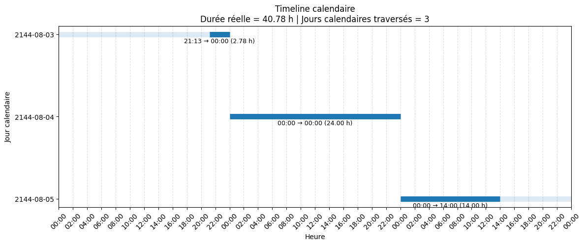

# Dataset expérimental

## Source des données

Les expériences ont été réalisées à partir de la base de données de soins intensifs MIMIC-IV (Medical Information Mart for Intensive Care), une base clinique librement accessible contenant des données anonymisées de patients hospitalisés en unités de soins intensifs.

Dans cette étude, seuls les patients porteurs d'un cathéter urinaire ont été retenus. Les informations nécessaires à la détection des infections urinaires associées aux cathéters (CAUTI) ont été extraites puis transformées afin de construire un jeu de données temporel dédié à l'analyse des facteurs de risque.

## Objectif métier
Si le temps de pose d'un cathéter est supérieur à 2 jours calendaires alors il peut être éligible au CAUTI

## Question
==Est que la durée en heure suffit pour calculer les jours calendaires ?==
## Dataset expérimental

Le dataset utilisé dans cette expérience est extrait de la base MIMIC-IV et construit à partir d'épisodes de cathétérisation urinaire.

Chaque ligne correspond à un intervalle temporel de cathétérisation.

| Variable         | Description                                        |
| ---------------- | -------------------------------------------------- |
| `t_start`        | Timestamp de début de l'intervalle                 |
| `t_end`          | Timestamp de fin de l'intervalle                   |
| `duration_hours` | Durée continue de l'intervalle, exprimée en heures |
| `y`              | Label binaire associé à l'intervalle (pré calculé) |
(Si temps de pose > 2 jours calendaires alors $y=true$)

Exemple d'observations :

| Index | t_start | t_end | duration_hours | y |
|---:|---|---|---:|---|
| 0 | 2162-02-17T23:15:00 | 2162-02-18T16:57:00 | 17.7000 | False |
| 1 | 2146-06-22T12:15:00 | 2146-06-30T12:00:00 | 191.7500 | True |
| 2 | 2133-03-05T15:58:00 | 2133-03-08T16:12:00 | 72.2333 | True |
| 3 | 2166-02-11T21:07:00 | 2166-02-20T08:55:00 | 203.8000 | True |
| 4 | 2136-01-25T07:00:00 | 2136-01-26T09:00:00 | 26.0000 | False |

La durée en heures est calculée par :

$$
\Delta t = t_{end} - t_{start}
$$

L'objectif de cette première expérience est d'évaluer ==si le label $y$ peut être prédit uniquement à partir de la durée continue $\Delta t$==.

Le dataset ne contient pas directement le nombre de jours calendaires traversés.  
Il contient uniquement les timestamps de début et de fin, ainsi que la durée continue en heures.


## Répartition des classes

| Classe | Nombre d'observations | Pourcentage |
|---------|---------:|---------:|
| True | 1659 | 57.60 % |
| False | 1221 | 42.40 % |
| **Total** | **2880** | **100.00 %** |
Le dataset contient 2880 intervalles de cathétérisation extraits de MIMIC-IV.

La classe positive (`True`) représente 57,6 % des observations tandis que la classe négative (`False`) représente 42,4 % des observations.

La distribution des classes est relativement équilibrée, ce qui permet d'utiliser l'accuracy comme première métrique de référence pour cette expérience.

## Objectif de l'expérience

==L'objectif de cette première expérience est d'évaluer dans quelle mesure la **durée de cathétérisation seule** permet de prédire l'éligibilité d'un CAUTI.==

Pour cela, nous construisons un classifieur naïf utilisant exclusivement la durée continue de cathétérisation exprimée en heures.

La règle de décision est définie par un seuil fixe de 48 heures (2 jours horaires):

$$
\tau = 48 \text{ heures}
$$

La prédiction est alors donnée par :

$$
\hat{Y} =
\begin{cases}
1 & \text{si } \Delta t > \tau \\
0 & \text{sinon}
\end{cases}
$$

où :

- $\Delta t$ représente la durée de cathétérisation en heures ;
- $\tau$ représente le seuil fixé à 48 heures ;
- $\hat{Y}$ représente la prédiction du modèle.

Cette règle correspond directement à l'algorithme suivant :

Notebook associé: C:\DEVELOPPEMENT\THESE\CAUTI_RESEARCH\P4_TEMPORAL_MODULE\00_DATASET\notebook\NB_dataset_analyse.ipynb

# Résultats

## Matrice de confusion

|                | Prédit False | Prédit True |
|----------------|-------------:|------------:|
| **Réel False** | 1221 | 0 |
| **Réel True**  | 551 | 1108 |

### Détail

| Mesure              | Valeur |
| ------------------- | ------ |
| Vrais Négatifs (VN) | 1221   |
| Faux Positifs (FP)  | 0      |
| Faux Négatifs (FN)  | 551    |
| Vrais Positifs (VP) | 1108   |


## Métriques de classification

|Classe|Précision|Recall|F1-score|Support|
|---|---|---|---|---|
|False|0.69|1.00|0.82|1221|
|True|1.00|0.67|0.80|1659|
|**Accuracy**|||**0.81**|2880|

## Analyse des résultats

L'utilisation exclusive de la durée de cathétérisation permet d'obtenir une précision globale d'environ :

Accuracy≈81%

==Ce résultat montre que la durée constitue un facteur explicatif important du phénomène observé.==

==Cependant, les performances restent imparfaites et révèlent l'existence d'une information temporelle supplémentaire non capturée par la durée seule.==

Le résultat le plus remarquable concerne l'absence totale de faux positifs :

FP=0

Le modèle ne prédit jamais un cas positif lorsqu'il devrait être négatif.

En revanche, il produit :

FN=551

faux négatifs.

Autrement dit, de nombreux cas réellement positifs sont incorrectement classés comme négatifs.

Ces erreurs sont particulièrement intéressantes car elles révèlent directement les limites du modèle basé sur la durée.


# Analyse des faux négatifs

## Définition

Un faux négatif correspond à la situation suivante :

```
Label réel      = True
Prédiction      = False
```

Le modèle conclut donc à tort que l'intervalle n'est pas éligible.


## Exemples

| t_start          | t_end            | Durée (h) | Label | Prédiction | Jours calendaires |
| ---------------- | ---------------- | --------- | ----- | ---------- | ----------------- |
| 2144-08-03 21:13 | 2144-08-05 14:00 | 40.78     | True  | False      | 3                 |
| 2163-12-06 19:04 | 2163-12-08 16:05 | 45.02     | True  | False      | 3                 |
| 2114-05-15 17:30 | 2114-05-17 09:15 | 39.75     | True  | False      | 3                 |
| 2185-04-16 19:29 | 2185-04-18 14:00 | 42.52     | True  | False      | 3                 |
| 2115-12-03 22:15 | 2115-12-05 00:51 | 26.60     | True  | False      | 3                 |
==Les durées sont inférieures à 48h, mais correspondent à 3 jours calendaires.==

## Interprétation

Ces exemples présentent une caractéristique commune :

```
Durée < 48 h
```

mais

```
Nombre de jours calendaires = 3
```

Prenons le premier exemple :

```
03 août 21:13
↓
04 août 00:00
↓
05 août 00:00
↓
05 août 14:00
```

L'intervalle traverse :

```
03 août
04 août
05 août
```

soit :

N=3 jours calendaires.

Pourtant :

$$\Delta t = 40.78\ h$$


et le modèle fondé uniquement sur la durée conclut :

```
False
```



## Enseignement principal

Ces erreurs montrent que la décision ne dépend pas uniquement du temps écoulé.

Elle dépend également du nombre de frontières calendaires traversées.

Deux intervalles de durée comparable peuvent produire des décisions différentes selon leur position dans le calendrier.

Nous observons donc que :

$Y \neq f(\Delta t)$

==La durée reste informative mais elle n'est pas suffisante pour expliquer la totalité du phénomène.==

# Conclusion

L'analyse des faux négatifs met en évidence une structure temporelle discrète cachée dans les données.

Cette structure n'est pas liée à la durée continue elle-même mais au nombre d'unités calendaires traversées par l'intervalle.

Les erreurs observées suggèrent ainsi l'existence :

- d'une période temporelle sous-jacente ;
- de frontières calendaires discrètes ;
- d'un mécanisme de comptage associé à ces frontières.

La question devient alors :

> Comment découvrir automatiquement cette structure temporelle à partir des données sans la fournir explicitement au modèle ?

Cette question constitue le point de départ de la recherche présentée dans la suite de ce travail.