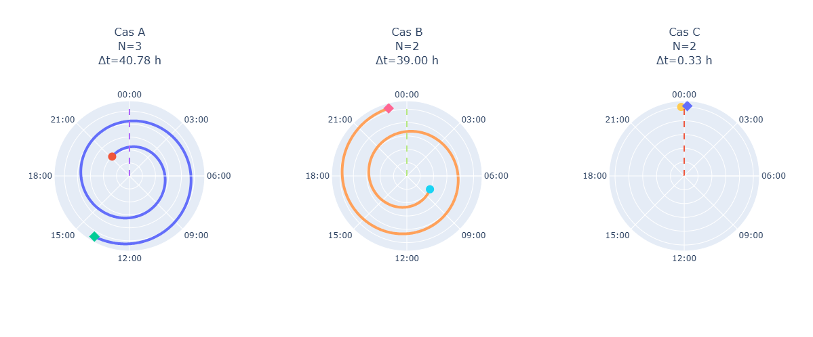

# Calcul de la frontière temporelle

## Introduction

La section précédente a montré que la décision ne dépend pas uniquement de la durée observée.

L'analyse des faux négatifs a révélé l'existence de frontières temporelles qui découpent le temps continu en unités discrètes.

Nous avons alors formulé l'hypothèse suivante :

$$  
Y = f(N)  
$$

où :

$N$ représente le nombre d'unités temporelles traversées par un intervalle.

Une nouvelle question apparaît alors :

> Comment déterminer automatiquement la position de ces frontières temporelles ?

# Une intuition simple

Considérons une horloge.

```text
00:00
01:00
02:00
...
23:00
00:00
```

Le temps semble organisé selon un cycle qui se répète régulièrement.

Cette répétition suggère l'existence d'une période :

$$  
T  
$$

définissant l'espacement entre deux frontières successives.

# Définition d'une période

Une période correspond à la durée séparant deux occurrences successives d'un même événement.

Par exemple :

```text
minuit
↓
minuit suivant
```

La période associée vaut :

$$  
T = 24,\mathrm{h}  
$$

Dans le cas des jours calendaires, les frontières apparaissent donc régulièrement tous les :

$$  
24,\mathrm{h}  
$$

# La notion de phase

Connaître la période seule ne suffit pas.

Il faut également connaître la position exacte des frontières.

Considérons deux systèmes :

### Système A

```text
00:00
24:00
48:00
72:00
```

### Système B

```text
06:00
30:00
54:00
78:00
```

Les deux systèmes possèdent la même période :

$$  
T = 24,\mathrm{h}  
$$

mais les frontières ne sont pas alignées.

Cette différence est décrite par un paramètre appelé phase :

$$  
\phi  
$$

# Définition de la phase

La phase représente le décalage de l'origine temporelle.

Elle indique où commence le premier cycle.

Une frontière temporelle apparaît alors aux instants :

$$  
\phi + kT  
$$

avec :

$$  
k \in \mathbb{Z}  
$$


# Problème posé

À ce stade, nous ne connaissons ni :

$$  
T  
$$

ni :

$$  
\phi  
$$

Nous devons donc les découvrir à partir des données.

Le problème devient :

> Quelle combinaison de (T) et ($\phi$) permet de reproduire au mieux les labels observés ?


# Comptage des unités temporelles

Si une période et une phase sont connues, il devient possible de compter le nombre d'unités traversées par un intervalle.

Considérons :

$t_s$ temps de début,

et

$t_e$ temps de fin.

Le nombre d'unités traversées est :

$$
N(T,\phi)
=
\left\lfloor
\frac{t_e-\phi}{T}
\right\rfloor
-
\left\lfloor
\frac{t_s-\phi}{T}
\right\rfloor
+1
$$

Cette formule compte le nombre de compartiments temporels rencontrés entre les deux instants.

# Exemples

| Cas | Début       | Fin         | Durée ($\Delta t$) | Phase $\phi$ | Jours calendaires ($N$) |
| --- | ----------- | ----------- | -----------------: | -----------: | ----------------------: |
| A   | 03/08 21:13 | 05/08 14:00 |            40.78 h |           24 |                       3 |
| B   | 03/08 08:00 | 04/08 23:00 |            39.00 h |           24 |                       2 |
| C   | 03/08 23:50 | 04/08 00:10 |             0.33 h |           24 |                       2 |
$$  
N = 3  
$$



# Utilisation de T et $\phi$ sur le dataset de MIMIC 

Lors de la précédente expérience basée uniquement sur la durée, nous avions obtenu un score de classification de 84%

Selon les règles du NHSN, un jour calendaire est défini sur une période de 24h où chaque jour commence à 00:00.

Donc:
$T=24$ et $\phi = 0$

Si nous appliquons ces paramètres permettant de calculer $N$ et appliquons la règles :

$$
\hat{Y} =
\begin{cases}
1 & \text{si }  N > 2 \\
0 & \text{sinon}
\end{cases}
$$
Nous devrions obtenir un score de 100%

## Note book 

C:\DEVELOPPEMENT\THESE\CAUTI_RESEARCH\P4_TEMPORAL_MODULE\01B_T_AND_PHI\01_T_AND_Phi.ipynb

# Résultats de classification  
  
| Classe | Precision | Recall | F1-score | Support |  
|----------|----------:|----------:|----------:|----------:|  
| False | 1.00 | 1.00 | 1.00 | 1221 |  
| True | 1.00 | 1.00 | 1.00 | 1659 |  
| **Accuracy** | | | **1.00** | **2880** |  
| Macro avg | 1.00 | 1.00 | 1.00 | 2880 |  
| Weighted avg | 1.00 | 1.00 | 1.00 | 2880 |  
  
### Précision globale  
  
$$  
Accuracy = 100\%  
$$
## Conclusion

L'application directe de la représentation temporelle fondée sur :

$$
T = 24
$$

et :

$$
\phi = 0
$$

permet de retrouver parfaitement les labels du dataset.

Cette expérience montre que la durée continue seule ne constitue pas une représentation suffisante du phénomène étudié. La structure temporelle sous-jacente repose sur un découpage discret du temps en jours calendaires, défini par une période et une phase.

Les résultats obtenus confirment que le calcul de :

$$
N(T,\phi)
$$

est la variable déterminante permettant d'expliquer la règle NHSN.

Nous pouvons ainsi rejeter l'hypothèse selon laquelle la décision dépend uniquement de la durée :

$$
Y = f(\Delta t)
$$

et privilégier l'hypothèse :

$$
Y = f(N(T,\phi))
$$

Cette observation constitue un résultat important car elle démontre que l'identification correcte de la période $T$ et de la phase $\phi$ est une condition nécessaire à la reconstruction des règles temporelles présentes dans les données.

La question suivante devient alors :

> Comment découvrir automatiquement les paramètres $T$ et $\phi$ lorsque ceux-ci ne sont pas connus a priori ?

Cette problématique constitue le point de départ du module temporel.


